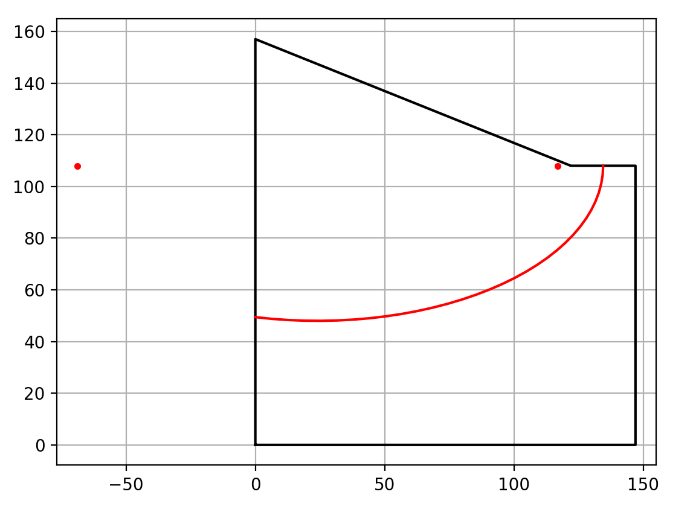

```
$ python ellipse_calculator.py
  x y
  0 49.432300
  6 48.801405
 12 48.354850
 18 48.088516
 24 48.000000
 30 48.088516
 36 48.354850
 42 48.801405
 48 49.432300
 54 50.253579
 60 51.273509
 66 52.503042
 72 53.956482
 78 55.652476
 84 57.615512
 90 59.878259
 96 62.485396
102 65.500254
108 69.017318
114 73.188472
120 78.287924
126 84.923077
132 95.309326
134 108.000000
```


